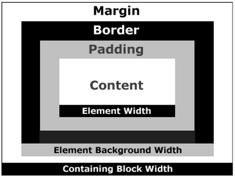

autoscale: true
footer: © New York Code + Design Academy 2016
slidenumbers: true

# [fit] CSS Layout Review

Examining page layout methods with CSS

---

# Learning Objectives

- Define the box model, understand how it works

- Learn the difference between display types

- Be able to create multiple forms of layout using HTML and CSS

---

# Our plan:

- The Box Model

- Display Types

- Floats

- Positioning

---

# The Box Model

---

> All HTML elements can be considered as boxes.

^ What does this mean? Open up the inspector. Hover through the DOM. Everything highlights as a box.

---

# The Box Model



The **"Box Model"** describes how spacing around these boxes works!

---

# The Box Model

- **content** - "text" inside of an HTML element

- **padding** - space between the content and a border

- **border** - a line around an element - comes after padding

- **margin** - space before next element - comes after border

---


---

> Every element has these box-model properties!

---

# Margin and Padding

````css
margin: 20px;
````

Put a 20 pixel margin around the element

````css
padding: 50px;
````

Put 50 pixels of padding around the element

---

# Specific Sides

Append a specific side to padding or margin to apply the value to only that side!

````css
padding-right: 10px;
margin-left: 40px;
padding-bottom: 20px;
margin-top: 10px;

````

---

# Shorthand

You can also apply values to specific sides with just one rule!

```css
/* 10px margin on all 4 sides */
margin: 10px;

/* 10px top/bottom, 20px left/right */
margin: 10px 20px;

/* 10px top, 20px left/right, 30px bottom */
margin: 10px 20px 30px;

/* 10px top, 20px right, 30px bottom, 40px left */
margin: 10px 20px 30px 40px;
```

---

# Shorthand

For example:

```css
margin-left: 20px;
margin-right: 20px;
margin-top: 40px;
margin-bottom: 40px;
```

becomes

```css
margin: 40px 20px;
```

All of this applies to `padding` as well!

---

# Centering content

````css
width: 900px;
margin: 0 auto;
````

- Use `auto` for `margin-left` and `margin-right` to center an element!
- This will only work for elements with a `width` property.

---

# Demo

^ Use a `#wrapper` and center content on the page

---

# Border Styles

````css
border-style: dashed;
````

- `border-style` - gives style to border!
- other possible values: `solid` (default), `dotted`

````css
border-width: 10px;
````
- `border-width` - sets border width

---

# Border Styles

````css
border-color: #111111;
````

- `border-color` - sets a border color

````css
border: 1px solid red;
````

- `border` - shorthand; set all 3 properties at once!
- `border: [width] [style] [color]`

---

# Box Sizing

Controls how the width of an element is calculated.

````css
box-sizing: border-box; /* default is content-box */
````

---

# Box Sizing

- content-box
element width = content width

- border-box
element width = content width + padding + border


---

# Exercise #1: Using the box model

Create a `<p>` element with some text in it.

Try giving it `padding`, `border`, and `margin` to see the effects each of these properties have on the element!

Also try giving it box-sizing value of border-box and a pre-defined width value. See how this affects the rendering of the element.

---

# Display Types

---

# Display Types

There are two primary display types:

- `inline`

- `block`

---

# `display: block`

- takes up as much space as is available
- can have set dimensions / padding / margins
- appears on a new line

````html
<!-- Elements that are normally block -->
<p></p>
<div></div>
````

---

# `display: inline`

- takes up only as much space as it needs
- cannot have set dimensions
- cannot only have left / right margins
- padding is applied ineffectively
- appears on the same line

````html
<!-- Elements that are normally inline -->
<em></em>
<span></span>
<strong></strong>
````

---

# `display: inline-block`

- takes up as much space as it needs
- can have set dimensions / padding / margins
- appears on the same line!

---

# `display: inline-block`

- takes up as much space as it needs (`inline`)
- can have set dimensions / padding / margins! (`block`)
- appears on the same line! (`inline`)

_Think of `inline-block` as as `inline`, but with dimensions!_

---

# Exercise #2: `inline` vs `block` vs `inline-block`

- Create 4 `<p>` elements with 4-5 sentences of `lorem ipsum` inside of them, with some of these words selected with `<span>` tags

- Give all of the elements different classes, give them a set width (say 250px) and try seeing what happens when you change `display: block` elements to `display: inline` elements and vice-versa

- Also experiment with `display: inline-block`

- To more clearly see what's going on, try putting a border around your elements

---

# Floats

---

# Problem statement

- Block elements
	- Have set dimensions
	- But force a new line

- Inline elements
	- Appear on the same line
	- Can't have set dimensions

---

# Problem Statement

- Inline-block elements
	- Appear on the same line
	- Can have set dimensions
	- Render with white-space issues

---

> With all of these issues, how do I define a page layout?

---

# Floats

- Originally intended for wrapping text _around_ other page elements

---


---

# `float`

````css
.my-element {
	float: left;
}
````

- Move the element all the way to the left side of its container.
- Have all other elements flow around it... kinda.

---

# `float`

Two items to discuss:

	- floated adjacent siblings
	- Height Issues

---

# Floated adjacent siblings

- If two elements are...
	- adjacent siblings
	- floated in the same direction
- ... then they will appear next to each other!
	- (if they can fit)

---

# Floated adjacent siblings

Example:

```
/* CSS */
.my-float {
	float: left;
}
```

```
<!-- HTML -->
<div class="my-float"></div>
<div class="my-float"></div>
```

---


---

# Demo: Height Issues

---

# Floats: Height Issues

_When an element is floated, its following non-floated elements will NOT respect its height when establishing a new block context._

---

> `clear`

---

# `clear`

```css
.my-non-floated-element {
	clear: left
}
```

- `clear` - Allows element to "clear" past elements floated in a particular direction when establishing a new block context.
	- `left` - past elements with `float: left`
	- `right` - past elements with `float: right`
	- `both` - past elements with either!

---

# `clear`


---

> "Where do I use float?"

---


# Using `float` for page layout

- To create a two-column page layout, float the first and second column left

- Try resizing the page to a smaller width - the second column will collapse under the first (left) column

---

# Using `float` for page layout

- You could use `float: left;` to create a dynamic image gallery

- `float` each image left and give it a `margin-right` and `margin-bottom` to enforce space


- As you resize the page, the images will stack nicely

---


# Using `float` for page layout

- To add an image to the page with text flowing around it, float it left

- Try adding some `margin-right` and `margin-bottom` to the image

---

# Exercise #3: `float`s

- Create 2 `<p>` elements with 4-5 sentences of `lorem ipsum` inside of them

- Also put an `` element on the page above the `<p>` elements

- Give all of the elements different classes and try floating the `` first, than the `<p>` elements to get an idea of how floats impact page layout

---

# Positioning

---

# Positioning

- Positioning uses the `position` property

- Used when you want to break out of a normal block-context

- For example:
	- pop-ups
	- modals
	- toasters
	- burger-menus

---


---

# Positioning: Values

- The `position` property takes four possible values:
	- `static`
	- `relative`
	- `absolute`
	- `fixed`

---

# Positioning: What happens?

- When an element gets positioned...
	- it either does or does not remain within the flow of the document.
	- its location will be offset with respect to _something_.

- Offset?
	- Yes! Several properties are used to move the element.
	- `top`, `bottom`, `left`, `right`

---

# `position: static;`

This is the default value, so no positioning will occur!

---

# `position: relative;`

- When positioned _relatively_, an element:
	- will remain within the normal flow of the document.
	- will be offset with respect to its current location.

---

# `position: relative`

````html
<div class='move-me'>
  Some content
</div>
````

```css
/* Move the element 10 px down from its current location */
.move-me{
  position: relative;
  top: 10px
}
```

---

# `position: absolute;`

- When positioned _absolutely_, an element:
	- will NOT remain within the normal flow of the document.
	- will be offset with respect to the position of its closest non-statically positioned parent.

---

# `position: absolute`

````html
<div class='parent'>
	<div class='child'>Some content</div>
</div>
````

```css
/* Move .child 10px down from the top of .parent */
.parent {
	height: 100px;
	width: 100px;
	position: relative;
}
.child {
	position: absolute;
	top: 10px
}
```

---

# `position: fixed`

- When positioned in a _fixed_ manner, an element:
	- will NOT remain within the normal flow of the document.
	- will be offset with respect to the window.
	- will remain in place on scroll.

- Where have we seen this?
	- modals
	- 'Share' icons on blog pages

---

# `position: fixed`

```html
<div class='move-me'>
	Some content
</div>
```

```css
/* Move the element 10px from the top of the window */
.move-me {
	position: fixed;
	top: 10px;
}
```

---

## Offset directions

There are four offset directions: `left`, `right`, `top`, `bottom`

```css
.my-element {
	direction: Npx;
}
```

This means...
"_Move the element [Npx] **away** from the [direction] of [something]_[^1]."

[^1]: Where [something] is dependent on the type of positioning used!

---

## Offset directions

```css
.my-element {
	position: relative;
	top: 20px;
}
```

---

## Offset directions

```css
.my-element {
	position: relative;
	top: 20px;
}
```

"_Move `.my-element` `20px` away from the top of its current position._"

---

## Offset directions

```css
.my-element {
	position: absolute;
	left: 30px;
}
```

---

## Offset directions

```css
.my-element {
	position: absolute;
	left: 30px;
}
```

"_Move `.my-element` `30px` away from the left of the position of its closest non-statically positioned parent._"

---

## Offset directions

```css
.my-element {
	position: fixed;
	bottom: 300px;
}
```

---

## Offset directions

```css
.my-element {
	position: fixed;
	bottom: 300px;
}
```

"_Move `.my-element` `300px` away from the bottom of the window._"

---

# Final Exercise

**Create a fake website for a newspaper, "The New York Code + Design Academy Times"**

- There should be two pages

  - Home page, where 10 fake articles are listed in a two-column layout - they should all link to:

    - An example article with a link to Facebook that stays on the page no matter how much the page is scrolled

    - The example article should have a photo with text that wraps around the photo (hint: use a `float`!)

- Use `margin: 0 auto; width: 900px;` to make the pages look nice and centered

- If you finish the above, have fun with CSS making the newspaper look as professional as possible!


- Don't worry about any of the actual text - just use lorem ipsum.

---

# Resources

### Codecademy

[HTML & CSS - CSS Element Positioning, HTML & CSS Projects](https://www.codecademy.com/learn/web)

### TeamTreeHouse

[CSS Layout Techniques](https://teamtreehouse.com/library/css-layout-techniques)

---

# Quiz

1. Going from the inside of an element - how is the box model laid out?

2. What are the two primary display types?

3. Name the 4 types of positioning and their functions.
