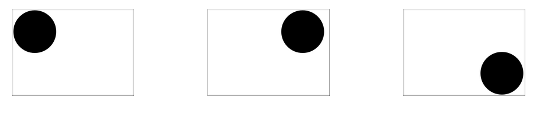
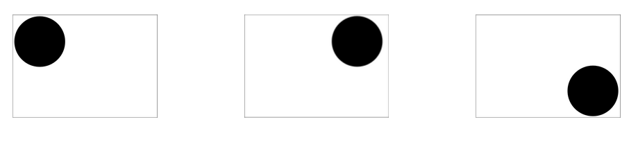

autoscale: true
footer: © New York Code + Design Academy 2016
slidenumbers: true

# CSS Transitions & Animations

---

# A note on cross-browser compatibility

- All of the things you’ll learn here may not work well in older browsers (IE9<)

- Always be sure to cross-browser test your work if working on a production website

---

# Vendor Prefixes

- Try using vendor prefixes, which are browser-specific CSS properties

  - See [prefix-free](http://leaverou.github.io/prefixfree/)

  - Use SASS Mixins that provide vendor prefixes

  - For the purposes of this presentation, we’ll assume you’ll add vendor prefixes yourself later on

---

# 2D Transforms

- An element can be moved around the page with ease, kind of like using positioning

- An element's appearance can be changed and warped

---

# `scale()`

```scss
transform: scale(4, 2);
```
transforms the width to be 4 times its original size and the height to be 2 times its original size

---

# `translate()`

```scss
transform: translate(25px, 50px);
```
moves an element 25 pixels from the left and 50 pixels from the top

---

# `rotate()`

```scss
transform: rotate(30deg);
```
rotates an element 30 degrees.

```scss
transform: rotate(-30deg);
```

negative values rotate the element counter-clockwise

---

# `skewX() and skewY()`

```scss
transform: skewX(60deg) skewY(40deg);
```
turns the element 60 degrees on the x axis and 40 degrees around the y axis

(`skew()` by itself was deprecated)

---

# 3D Transforms

```scss
transform: rotateX(120deg);
```
Rotates an element 120 degrees around its x axis

```scss
transform: rotateY(160deg);
```
Rotates an element 160 degrees around its y axis

---

# Exercise

Build an example page with `<h2>` headings denoting each function to illustrate `scale, translate, rotate, skew, rotateX, and rotateY` CSS transforms

---

# Transitions

A transition changes one or many attributes of an element’s style gradually

```scss
transition: width 10s;
```
The above will define the time of a `transition` if the `width` property changes, for instance if the element has a different `width` on `:hover`

---

# Transitions

Transitions can also be broken out into their component properties:

```scss
transition-property: background-color;
transition-duration: 1s;
transition-timing-function: linear;
transition-delay: 2s;
```

---

# `transition-property`

Defines the CSS property that a transition is applied to.

```scss
transition-property: width;
transition-property: background-color;

transition: <property> <duration> <timing-function> <delay>;
```

---

# `transition-delay`

Specifies how long until the transition starts

```scss
transition-delay: 2s;

transition: <property> <duration> <timing-function> <delay>;
```

---

# `transition-duration`

Specifies how long the transition will last

```scss
transition-duration: 2s;

transition: <property> <duration> <timing-function> <delay>;
```

---

# `transition-timing-function`

Specifies which “timing function” or “easing” will be used for the transition. 

Possible values include `ease, linear, ease-in, ease-out, ease-in-out,` and `cubic-bezier` to define custom functions.

```scss
transition-timing-function: cubic-bezier(0,0,0.58, 1);
transition: <property> <duration> <timing-function> <delay>;
```

---

# `easings.net`

Check out easings.net for more examples of easing functions

---

# Transitions
###some sample code - element width

```scss
.box{
  background-color: orange;
  width: 200px;
  height: 100px;
}
.box:hover{
  width: 400px;
  height: 100px;
}
.box{
  transition: 10s width;
}
```

```html
<div class="box">
  Hi  box.
</div>
```

---

# Transitions
###some _more_ sample code - background color and linear easing

```scss
.box{
  background-color: #CCCC33;
  width: 200px;
  height: 100px;
}
.box:hover{
  width: 400px;
  height: 100px;
  background-color: #0E0EFF;
}
.box{
  transition: background-color 4s linear;
}
```

```html
<div class="box">
  Hi  box.
</div>
```

---

# Multiple transitions together

You can have multiple properties transition, they just have to be separated by commas:

```scss
transition: width 10s, background-color 10s linear;
```
The above will set up transitions for the `width` property and the `background-color` property. `linear` is the type of easing, or “timing function” that will be used

---

# Transitions
###some _more_ sample code - background color + width

```scss
.box{
  background-color: #CCCC33;
  width: 200px;
  height: 100px;
}
.box:hover{
  width: 400px;
  height: 100px;
  background-color: #0E0EFF;
}
.box{
  transition: background-color 4s linear, width 4s;
}
```

```html
<div class="box">
  Hi  box.
</div>
```

---

# Exercise

Try building different CSS transitions on 3 different elements. Try animating the following properties:

```scss
background
width
padding
margin
color
```

---

# CSS3 Animations

Remember when the web was covered in Macromedia Flash videos and games?

A similar effect can now be achieved with straight CSS using CSS3 animations.

These allow the use of **keyframes** to define the breakpoints of an animation

---

# Keyframes

A keyframe is a moment that defines the starting and ending points of a smooth transition

For instance, if an object was moving to the right and to the bottom of the screen in an animation, you’d might have the following keyframes:



---

# CSS3 Animations

The way CSS3 animations work: you define an animation by defining keyframes based on percentages

For instance, if your animation has a keyframe at 50% and is 6 seconds long, the animation will reach that keyframe at the 3 second mark

For animations, you’ll almost definitely have to use a vendor prefix (-webkit-)

---

# Keyframes

```scss
@-webkit-keyframes some-keyframe{
  0% {margin-left: 0px; margin-top: 0px;}
  25% {margin-left: 50px; margin-top: 50px;}
  50% {margin-left: 50px; margin-top: 150px;}
  100% {margin-left: 200px; margin-top: 200px;}
}
```

---

# Calling Your Animation

Now that you’ve defined keyframes for your animation, you have to call the animation on an element and define a few more options for the animation itself

---

# Animation Properties

```scss
.box{
  /*The name of your defined animation (after @keyframes)*/
  -webkit-animation-name: some-keyframe;
  /*How long the animation will run*/
  -webkit-animation-duration: 5s;
  /*Which easing/timing function to use */
  -webkit-animation-timing-function: linear;
  /*How long to wait before starting the animation*/
  -webkit-animation-delay: 2s;
  /*how many times to run it (can be infinite)*/
  -webkit-animation-iteration-count: 2;
  /*should animation play in reverse on alternate runs */
  -webkit-animation-direction: alternate;
  /*should the animation start of running or paused */
  -webkit-animation-play-state: running;
}
```

---

# Exercise

Try constructing the animation illustrated on the Keyframes slide! Your element doesn’t necessarily have to be circular, but it should travel to the right and then the bottom of the screen



---

# You can do some pretty crazy things with CSS3 Animations.

CSS Solar System:
[http://codepen.io/juliangarnier/pen/idhuG](http://codepen.io/juliangarnier/pen/idhuG)

CSS Creatures:
[http://bennettfeely.com/csscreatures/](http://bennettfeely.com/csscreatures/)

Original Hover Effects:
[http://bennettfeely.com/csscreatures/](http://tympanus.net/Tutorials/OriginalHoverEffects/)

---

# Alternate ways to trigger transitions

Remember how we were only using :hover events in the last class to trigger transitions?

You could just apply a class using JavaScript:

```js
$(".some-trigger").on("click", function(){
  $(".some-animated-element").addClass("transition-class")
})
```

---

# Best Practices

- Best-practices-wise, you should probably use as little JavaScript as possible when creating CSS3 animations/transitions

- Instead, try to achieve what you’re looking to achieve through CSS unless it is practically impossible.

- Another place to use JavaScript might be if a certain transition is having cross-browser compatibility problems - these will vary depending on many factors because CSS3 animations are still not widely supported

---

# Exercises

Try creating your own CSS3 Animation!